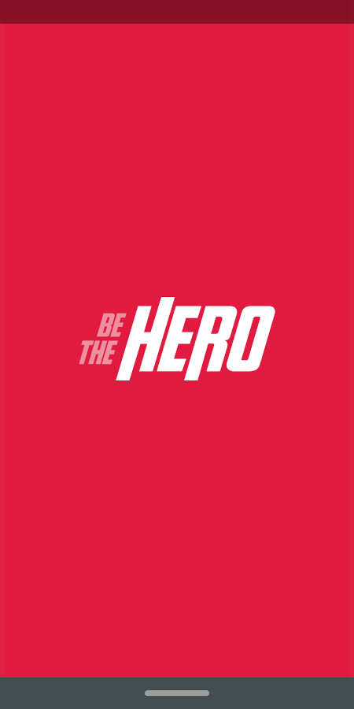

<h1 align="center">
    
</h1>

<h2 align="center"> Aplicação para conectar ONG e Empresas/Pessoas dispostas a ajudar </h2>

<h3 align="center"> Criada com a stack  React,  React Native,  Node e  SQLite </h3>

  

 Usando o poder de uma stack poderosa, que utiliza de uma única linguagem popular e moderna, o  JavaScript.   Produtividade e performance de forma enxuta. 

---

A última edição da Semana OmniStack, ocorrida entre 23/03 e 27/03, trouxe como projeto uma aplicação web e mobile inédita mais uma vez, o sistema desenvolvido para conectar pessoas dispostas a ajudar a ONGs que precisam de algum tipo de ajuda em suas tarefas.

## Para rodar a aplicação

> OBS: pode-se utilizar o gerenciador de pacotes npm ou o yarn para rodar os comandos abaixo

Execute `npm install` nas pastas backend, frontend e mobile, para instalar as dependências.

Rode `npm start` nas pastas backend e frontend para utilizar a versão web. Acesse via **localhost:3000**.

## Telas

    
    
    
    
    
    

---

**&copy;  [Rocketseat](https://rocketseat.com.br/)**

**Instrutor: [Diego Fernandes](https://github.com/diego3g) | CTO Rocketseat**

<h4 align="center"> <em>&lt;/&gt;</em> by <a href="https://github.com/telurt" target="_blank">telurt</a> </h4>
